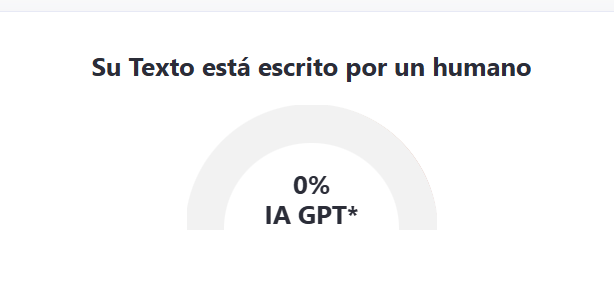

## UD3 – Práctica 1 – Login de usuario

## Descripción del proyecto

**PGL-UserLogin** es una aplicación móvil desarrollada con **React Native**, **Expo** y **TypeScript**, cuyo objetivo principal es implementar un sistema completo de **registro** y **autenticación de usuarios** mediante **tokens JWT**, **validación de datos** y comunicación con una **API REST del profe Adri**.

---

## El proyecto amplía la funcionalidad desarrollada en la práctica anterior (PGL-Navigation), incorporando:

- Registro de usuarios

- Inicio de sesión

- Gestión de sesión mediante token

- Control de acceso a la navegación

- Persistencia de sesión usando AsyncStorage

## Objetivos principales

- Implementar un flujo completo de **registro** y **login de usuario**.
- Validar formularios de entrada (email y contraseña segura).
- Gestionar **tokens JWT** devueltos por la API.
- Almacenar y recuperar datos persistentes usando **AsyncStorage**.
- Proteger la navegación de la app según el estado de autenticación.
- Mostrar información al usuario mediante alertas.
- Mantener un flujo de trabajo correcto en GitHub con ramas y commits claros.
  -Documentar correctamente el desarrollo de la aplicación.

---

## Flujo de navegación de la aplicación

### Pantallas principales

- Pantalla de registro

- Pantalla de login

- Pantalla de bienvenida (solo accesible con token válido)

### Comportamiento según sesión

#### Si NO existe token guardado:

- Se redirige automáticamente a la pantalla de login
- No se muestra el Drawer

#### Si existe token:

- Se permite el acceso a la navegación principal
- Se muestra la pantalla de bienvenida

---

## Gestión de sesión

- El token JWT se guarda en AsyncStorage tras un login exitoso.

- El token se utiliza para acceder a endpoints protegidos de la API.

- Se implementa un cierre de sesión, que:

- Elimina el token del dispositivo

- Redirige al usuario a la pantalla de login

## Documentación de cada ejercicio

Cada ejercicio de la práctica tiene un **README individual** con explicación detallada, código y ejemplos.

| Ejercicio   | Descripción                               | Enlace                            |
| ----------- | ----------------------------------------- | --------------------------------- |
| Ejercicio 1 | Registro de usuario                       | [Ver README](./docs/DocsOne.md)   |
| Ejercicio 2 | Inicio de sesión (Login)                  | [Ver README](./docs/DoscTwo.md)   |
| Ejercicio 3 | Modifica la app según el token de usuario | [Ver README](./docs/DocsThree.md) |
| Ejercicio 4 | Cierre de sesión                          | [Ver README](./docs/DocsFour.md)  |
| Ejercicio 5 | Botón en pantalla de bienvenida           | [Ver README](./docs/DocsFive.md)  |

Y para que veas el empeño que le he puesto

