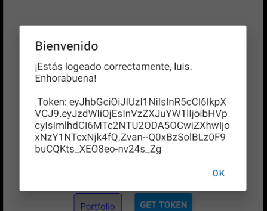
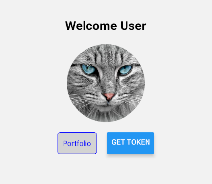

# Ejercicio 5

## Añadir boton que muestre el mensaje devuleto por el endpoint y el token de usuario

### Codigo

#### Boton

El boton al ser precionado llama a la funcion **getInfo**, y el resultado, si **no es null**, se pinta por pantalla en un **Alert**, y de lo contrario da **error**

```
<Button
          title="get token"
          onPress={async () => {
            const result = await getInfo();
            if (!result) {
              Alert.alert("Error", "No se pudo obtener la información");
              return;
            }
            Alert.alert(
              "Bienvenido",
              `${result.data.object} \n\n Token: ${result.token}`
            );
          }}
        ></Button>
```

#### mensaje



#### Logica

La funcion, **busca si hay un token en sistema**, si **no lo hay** notifica con un mensaje, **si lo hay** lo envia al **endpoint (welcome)**, que nos devuelve un {**mensaje**,un **objeto** y un **status**}. Yo **retorno un objeto** con la **mezcla de estos dos** **{data + token}** para que en el **login** pueda **mostrar** tanto el **mensaje** como el **token** al usuario.

```
export async function getInfo(): Promise<{ data: WelcomeResponse, token: string } | null> {
  const token = await AsyncStorage.getItem('userToken');

    if(!token){
        console.error("No hay tokens campeon");
        return null;
    }
    try {

        const response = await fetch("http://192.168.0.12:5000/welcome", {
            method: "GET",
            headers: {
                "Content-Type": "application/json",
                "Authorization": `Bearer ${token}`
             },
        });

        const data:WelcomeResponse = await response.json();

        if(data.statusCode === 200){
            return {data, token};
        } else {
            console.error("Token vencido sinverguenza");
            return null;
        }

    } catch (error) {
        console.error("Error en la petición:", error);
        return null;
    }


}
```

#### captura (este es el boton :)) [get token]



[Volver al README](../README.md)
