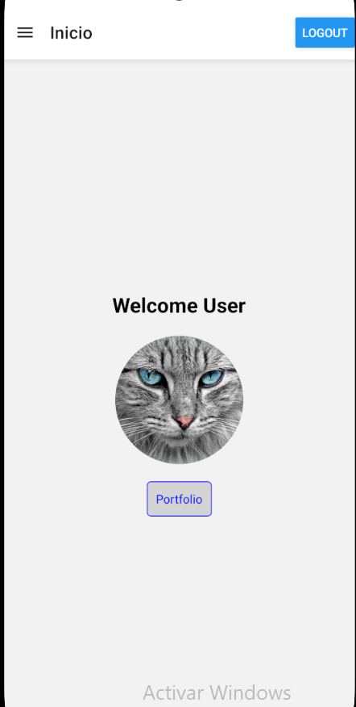

# Ejercicio 4

## Implementar cierre de sesion

creamos un **boton** en el **drawer**, que al ser presionado _llamara a una funcion_, que se encargara de **eliminar el token** con la clave **userToken** del **async-storage** y redirigir al ususario a la pagina del **login**, segun lo solicitado por ti **Adri**.

### codigo

#### funcion que elimina el token y redirige al usuario

```
export const logout = async () => {
  try {
    await AsyncStorage.removeItem("userToken");
    router.replace("/login");
  } catch (error) {
    console.error("Error al cerrar sesion:", error);
  }
};
```

#### boton a la derecha del drawer dentro de la pagina de bienvenida dentro del proyecto anterior (navigation)

```
    <Drawer
      screenOptions={{
        headerRight: () => <Button title="Logout" onPress={logout} />,
      }}
    >
```

### captura



[Volver al README](../README.md)
