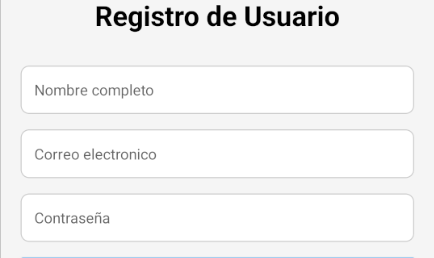
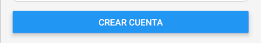
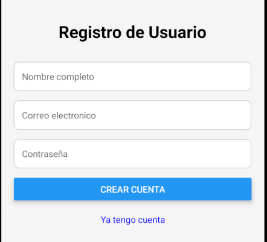
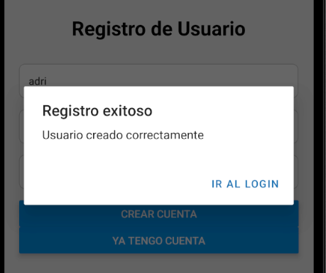
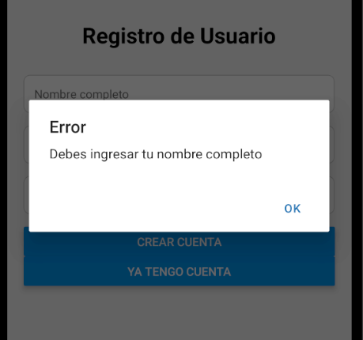
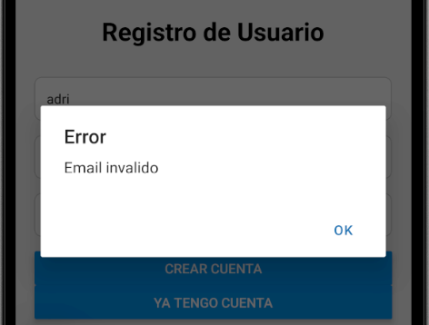
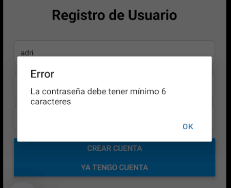
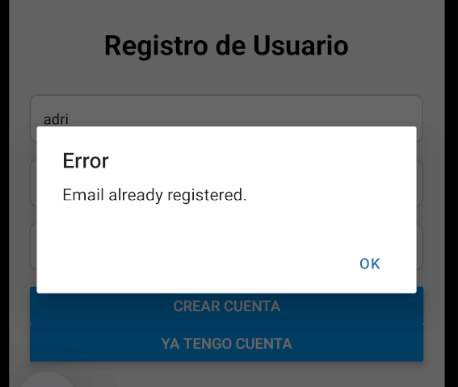
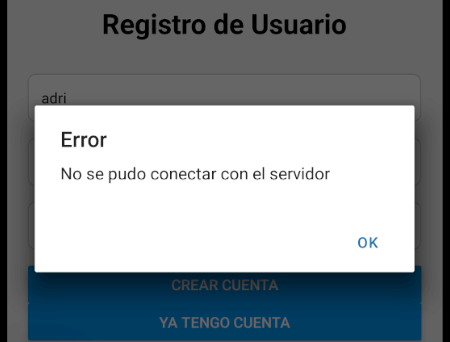

# Ejercicio 1

## Pantalla de registro de usuario

### Inputs de texto para el nombre,email y contraseña

### codigo

```
      <TextInput
        style={styles.input}
        placeholder="Nombre completo"
        value={fullname}
        onChangeText={setFullname}
      />

      <TextInput
        style={styles.input}
        placeholder="Correo electronico"
        value={email}
        onChangeText={setEmail}
        keyboardType="email-address"
        autoCapitalize="none"
      />

      <TextInput
        style={styles.input}
        placeholder="Contraseña"
        value={password}
        onChangeText={setPassword}
        secureTextEntry
      />
```

### captura



### Boton que valida inputs

### codigo

Al presionar el boton ejecuta la funcion **handlerRegister** y le pasa por parametro un objeto que contiene los valores de el nombre,email y contraseña del ususario

```
      <Button
        title="Crear cuenta"
        onPress={() => handleRegister({ fullname, email, password })}
      />
```

#### funcionalidad

Se reciben los datos del usuario y se valida que el nombre no este **vacio** , que el email cumpla con tener un **@** y un punto **(.)** y que la contraseña tenga minimo **6 caracteres**.

Si el objeto cumple con todo, se le envia a la api proporcionada por el **papasote Adri** y esta lo registrara en una base de datos **sqlito** ;p ;p , en caso de ser exitosa la accion, nos devuelve un objeto con una propiedad status, que evaluamos que sea **200 o 201**, de ser asi mostramos un **alert** con el mesaje de **Registro exitoso** y lo redirigimos a la pagina de **/Login**, de no ser asi, mostramos un **alert** con el mensaje de **Error** de respuesta de la api, y si **peta** por otro motivo (por lo general que no encendi la api ;p ) se muestra una alerta de **No se pudo conectar al servidor** o algo asi.

```
const handleRegister = async ({fullname,email,password}:user) => {

        if (!fullname) {
        Alert.alert("Error", "Debes ingresar tu nombre completo");
        return;
        }

        if (!validateEmail(email)) {
        Alert.alert("Error", "Email invalido");
        return;
        }

        if (!validatePassword(password)) {
        Alert.alert("Error", "La contraseña debe tener minimo 6 caracteres");
        return;
        }

        const userData = { fullname, email, pswd: password };

        try {
        const response = await fetch("http://192.168.0.12:5000/auth/register", {
            method: "POST",
            headers: { "Content-Type": "application/json" },
            body: JSON.stringify(userData),
        });

        if (response.status === 200 || response.status === 201) {
            await response.json();
            Alert.alert("Registro exitoso", "Usuario creado correctamente", [
            { text: "Ir al Login", onPress: () => router.push("/login") },
            ]);
        } else {
            const data = await response.json();
            Alert.alert("Error", data.message || "Error al registrar el usuario");
        }
        } catch (error) {
        Alert.alert("Error", "No se pudo conectar con el servidor");
        }
    };
```

### captura



### Capturas de pantalla (ejemplo)

Asi se ve mi login, pero las capturas de abajo son de una prueba anterior, y las deje porque me dio pereza cambiarlas, pera que lo tengas en cuenta, gracias campeon :).



Registro exitoso, con redireccion al login



Registro fallido (Nombre invalido)



Registro fallido (email invalido)



Registro fallido (contraseña invalida)



Registro fallido (Usuario ya existe)



Error de conexion



---

[← Volver al README Principal](../README.md)
