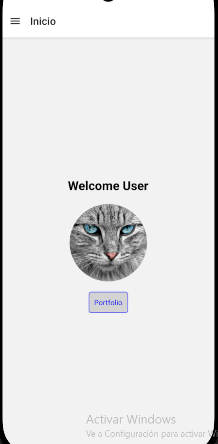
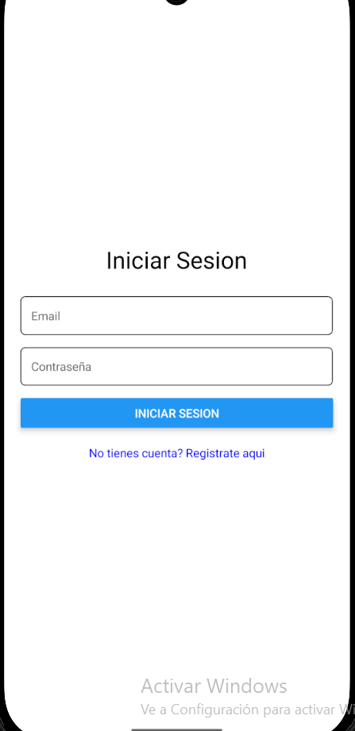

# Modificacion de la app

**Si no hay** un **token**, que redirija al usuario a la **pantalla de registro**, y **si lo hay**, que lo redirija a la **pantalla de welcome** de la aplicacion anterior.

Esto hace que al cargarse el **index.tsx** principal, se verifique si existe un token con la clave **userToken** que usamos para almacenar el token en el **async-storage** cuando ingresamos el usuario en la **pagina de login**,
en caso de que exista, redirigimos al usuario a la **pantalla de welcome** del **proyecto anterior**, y en caso negativo quiero decir que el usuario **no tiene un token**, por ende, no se ha registrado, y lo redirigimos a la pantalla de **register**.

### codigo

```
  useEffect(() => {
    const getData = async () => {
      try {
        const value = await AsyncStorage.getItem("userToken");
        if (value) {
          router.replace("/navigation");
        } else {
          router.replace("/login");
        }
      } catch (e) {
        console.error("Error reading userToken from AsyncStorage:", e);
      }
    };
    getData();
  }, []);
```

### captura

#### Si hay token, redirige a navigation



#### No hay token, redirige a la pantalla de login



[Volver al README](../README.md)
