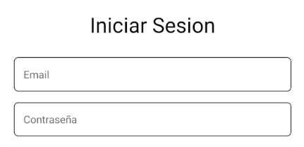
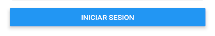
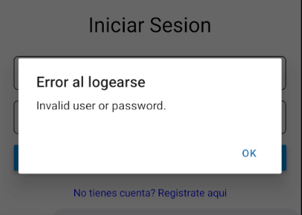
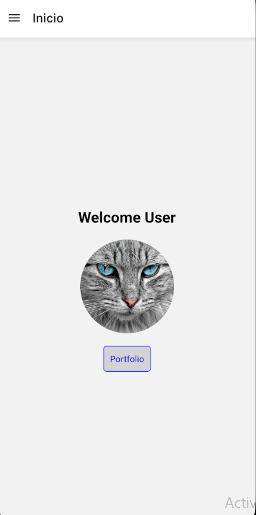
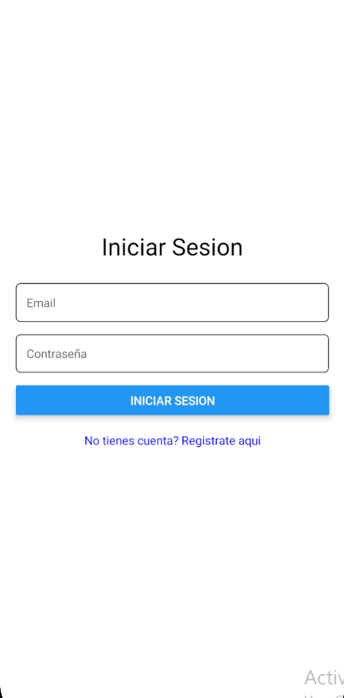

## Ejercicio 2

## Pantalla de inicio de sesion

### Inputs de texto para el email y la contraseña

### codigo

```
    <TextInput
        style={styles.input}
        placeholder="Email"
        value={email}
        onChangeText={setEmail}
        keyboardType="email-address"
        autoCapitalize="none"
      />

      <TextInput
        style={styles.input}
        placeholder="Contraseña"
        value={password}
        onChangeText={setPassword}
        secureTextEntry
      />
```

### captura



---

## Boton que valida datos y llama a funcion de servicio de la api

### codigo

```
    <Button
        title="Iniciar Sesion"
        onPress={() => {
          sendLogin(email, password);
        }}
      />
```

### validacion de datos, llamada a la api y almacenamiento de Token con async-storage

Aqui recibimos el **email y la contraseña**, validamos los datos de los inputs y luego se crea un objeto con esos datos, se le envian a la api, en caso de que los datos coincidan, nos devuelve un **estatus (200)** y si es correcto, tambien nos devolvio un **token**, que guardamos en asyncStorage y redirigimos a la pagina del **drawer (el welcome principal de la practica anterior)**, en caso contrario, mostramos un **mensaje de error**

```

export const sendLogin = async (email: string, pswd: string) => {


    if (!validateEmail(email)) {
    Alert.alert("Error", "Email invalido");
    return;
    }

    if (!validatePassword(pswd)) {
    Alert.alert("Error", "La contraseña debe tener minimo 6 caracteres");
    return;
    }

    // se llama pswd porque asi lo pide la api

    const loginData = { email, pswd};

  try {
    const response = await fetch("http://192.168.0.12:5000/auth/login", {
      method: "POST",
      headers: { "Content-Type": "application/json" },
      body: JSON.stringify(loginData),
    });

    const data = await response.json();

    if (data.statusCode === 200) {
      await AsyncStorage.setItem("userToken", data.object.token);
      router.push("/navigation");
    } else {
      Alert.alert("Error al logearse", data.message);
    }
  } catch (error) {
    console.error("Error en la solicitud de login:", error);
    Alert.alert("Error", "No se pudo conectar con el servidor.");
  }
};

```

## capturas del boton

### boton



### usuario erroneo (mensaje de la api)



### Usuario correcto

**al ingresar los datos correctos, lo redirige a la pagina principal del proyecto anterior (welcome)**



---

### Enlace a la pantalla de registro

Se añade un enlace a la pantalla de registro en caso de que el ususario no tenga cuenta

### codigo

```
    const handleLogin = () => {
        router.push("/login");
    };
```

### captura


## Pantalla Login completa



---

[← Volver al README Principal](../README.md)
